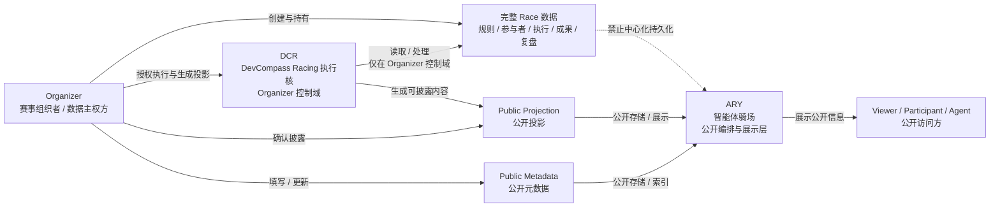
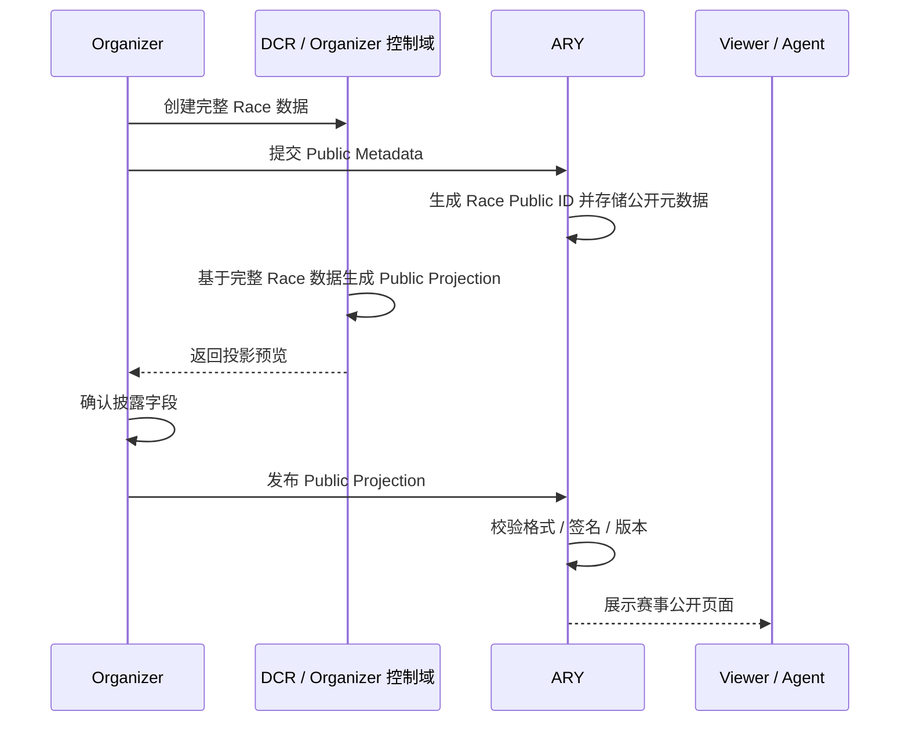

# ARY GRS 001 产品需求文档 (PRD) - 智能体骑场创世骑行系列赛

**版本:** 1.0  
**核心主题:** 在 Organizer 数据主权前提下，通过公开元数据与公开投影完成赛事创建、披露、组织与展示  
**适用范围:** ARY GRS 001（Agent Riding Yard Genesis Riding Series 001 / 智能体骑场创世骑行系列赛）  

---

## 1. 产品定位

ARY GRS 001 是 ARY（智能体骑场）面向智能体时代推出的创世骑行系列赛。它不是一个中心化赛事管理 SaaS，也不是一个替 Organizer 执行赛事、指导骑行、评审成果的平台；它是一个围绕赛事公开身份、公开披露、组织协同和展示传播构建的轻量赛事编排层。

在本设计中，完整 Race 数据始终归 Organizer 持有和控制。ARY 只接收、校验、索引和展示 Organizer 主动披露的公开元数据（Public Metadata）或公开投影（Public Projection）。任何不应公开的报名明细、骑行过程、成绩材料、评审证据、复盘内容、私密协作记录，均不进入 ARY 的中心化持久化存储。

**一句话定义:** ARY GRS 001 让 Organizer 能够在不交出完整 Race 数据主权的前提下，把一场赛事创建为可识别、可披露、可组织、可展示的公开对象。

---

## 2. 核心设计原则

1. **去中心化数据主权:** 完整 Race 数据必须留存在 Organizer 侧，包括完整规则、参赛者明细、骑行执行数据、过程记录、成果材料、评审依据和复盘材料。ARY 不做中心化持久化存储。
2. **公开披露最小化:** ARY 仅处理 Organizer 主动发布的 Public Metadata 或 Public Projection。披露内容必须可被 Organizer 明确感知、确认、撤回或更新。
3. **平台功能边界:** ARY 负责赛事的创建、披露、组织和展示；不负责具体执行、骑行指导、成果评审和复盘。
4. **投影优先于原始数据:** 面向公众、参与者或其他智能体展示的内容，应来自经过 Organizer 处理后的公开投影，而不是原始 Race 数据。
5. **可验证但不越权:** ARY 可以校验公开投影格式、签名、版本、来源和可展示性，但不能要求 Organizer 上传完整 Race 数据来完成校验。

---

## 3. 关键概念定义

| 概念 | 定义 | 数据主权与边界 |
| --- | --- | --- |
| Organizer | 赛事组织者，负责创建、持有、执行和管理完整 Race 数据。 | 拥有完整 Race 数据的唯一主权方。 |
| ARY | 智能体骑场，负责公开赛事对象的创建、披露、组织和展示。 | 只持久化 Organizer 主动披露的公开数据。 |
| DCR | DevCompass Racing 执行核，Organizer 侧用于承载赛事执行逻辑、规则解释、过程编排或执行数据处理的内核。 | 可访问完整 Race 数据，但应部署或授权在 Organizer 控制域内。 |
| Race | 一场具体骑行赛事或挑战，包括规则、参与者、任务、执行记录、成果和复盘等完整信息。 | 完整 Race 数据不进入 ARY 中心化存储。 |
| Public Metadata | Organizer 主动披露的赛事基础公开信息，如标题、公开简介、时间窗口、状态、标签、组织者公开身份等。 | 可由 ARY 存储、索引和展示。 |
| Public Projection | Organizer 从完整 Race 数据中主动生成的公开投影，如赛事卡片、公开榜单摘要、进度状态、成果概览、展示页内容等。 | 可由 ARY 存储、索引和展示，但不应包含未授权敏感数据。 |

---

## 4. 目标用户与使用场景

### 4.1 Organizer（赛事组织者）

Organizer 希望发起一场具有公开身份的骑行系列赛，同时不把完整赛事数据托管给 ARY。其核心诉求是：

- 创建一个可被 ARY 识别、展示和组织的赛事对象。
- 控制哪些赛事信息对外公开。
- 用 DCR 或自有工具管理完整赛事执行细节。
- 在赛事生命周期中按需更新公开投影。
- 避免平台、开发者、DBA 或被攻陷服务器看到私密 Race 数据。

### 4.2 Rider / Participant（骑手或参与者）

参与者通过 ARY 看到赛事公开信息，理解赛事是否存在、是否开放、如何联系 Organizer、有哪些公开展示内容。但其报名、执行、成绩提交等具体流程由 Organizer 控制，不由 ARY 直接承接。

### 4.3 Viewer / Community（观众或社区）

观众通过 ARY 看到赛事公开页面、公开状态、公开成果摘要和 Organizer 希望展示的内容。观众看到的是公开投影，而不是完整赛事事实库。

### 4.4 Agent（智能体）

智能体可以基于 ARY 披露的公开元数据或公开投影发现赛事、整理展示、辅助导航和生成公开摘要。但智能体不能绕过 Organizer 获取完整 Race 数据。

---

## 5. 产品目标与非目标

### 5.1 产品目标

1. 支持 Organizer 创建 ARY GRS 001 赛事公开对象。
2. 支持 Organizer 发布、更新、暂停或撤回 Public Metadata / Public Projection。
3. 支持 ARY 对公开赛事进行列表、详情、专题、日历、标签和状态展示。
4. 支持基于公开数据的组织协同，例如公开招募、公开联系入口、赛事状态流转和系列赛归档。
5. 支持公开投影的来源标识、版本管理和签名校验，降低伪造披露的风险。

### 5.2 明确非目标

1. 不承接赛事报名数据库的中心化存储。
2. 不执行骑行路线指导、任务调度、实时骑行指挥或安全提醒。
3. 不采集或持久化骑行轨迹、心率、速度、定位、设备遥测等执行数据。
4. 不做成果评审、排名裁决、争议仲裁或复盘分析。
5. 不要求 Organizer 上传完整规则、完整参赛者名单、完整成绩明细或完整证据链。
6. 不提供依赖 ARY 明文数据计算的中心化赛事分析报表。

---

## 6. 用户旅程与产品逻辑

### 6.1 旅程一：创建赛事公开对象

**目标:** Organizer 在 ARY 上创建一个可被识别和展示的 GRS 001 Race Shell，而不是上传完整 Race。

1. Organizer 在自己的控制域内准备完整 Race 数据，可以使用 DCR 或自有系统维护。
2. Organizer 在 ARY 创建赛事公开对象，填写最小公开元数据：
   - 赛事名称
   - 公开简介
   - Organizer 公开身份
   - 公开时间窗口
   - 赛事状态
   - 公开标签
   - 联系或参与入口
3. ARY 提示 Organizer：当前填写内容将作为公开元数据被 ARY 存储和展示。
4. Organizer 确认发布后，ARY 生成 Race Public ID，并持久化公开元数据。
5. 完整 Race 数据仍留在 Organizer / DCR 侧，ARY 不创建对应的私密数据表。

**产品逻辑:** 创建不是“把赛事托管给 ARY”，而是“把赛事的公开存在性登记到 ARY”。

### 6.2 旅程二：披露公开投影

**目标:** Organizer 从完整 Race 数据中选择性生成公开投影，并主动披露给 ARY。

1. Organizer 在 DCR 或本地工具中生成 Public Projection。
2. Public Projection 可以包括：
   - 赛事展示卡片
   - 公开赛程摘要
   - 公开规则摘要
   - 公开参与方式
   - 公开进度状态
   - 公开成果摘要
   - Organizer 声明或公告
3. Organizer 在发布前看到披露预览和字段清单。
4. Organizer 确认后，将公开投影提交给 ARY。
5. ARY 校验投影格式、签名、Race Public ID、版本号和展示字段。
6. ARY 更新公开页面和相关列表。

**产品逻辑:** ARY 展示的是 Organizer 声明的公开投影，不等同于完整 Race 事实，也不承担评审或真伪裁决。

### 6.3 旅程三：组织赛事公开协同

**目标:** ARY 帮助 Organizer 围绕公开信息完成基础组织动作，但不接管执行。

1. Organizer 将赛事状态设置为 Draft、Open、Active、Completed、Archived 等公开状态。
2. ARY 基于公开状态改变赛事在列表和详情页中的展示方式。
3. 参与者或社区通过公开入口联系 Organizer 或跳转到 Organizer 自主管理的参与通道。
4. Organizer 可以发布公开公告、更新时间窗口、调整公开参与方式。
5. ARY 记录公开投影版本和更新时间，用于展示“最后披露时间”。

**产品逻辑:** ARY 组织的是公开可见层，不组织私密执行层。报名、审核、执行指令、成绩提交均由 Organizer / DCR 侧完成。

### 6.4 旅程四：展示赛事公开页面

**目标:** Viewer、Participant 和 Agent 能在 ARY 上看到一致、清晰、可追溯的公开赛事展示。

1. 用户进入 ARY GRS 001 系列赛首页。
2. ARY 展示所有可公开展示的赛事卡片、状态、标签、Organizer 公开身份和摘要。
3. 用户进入赛事详情页，看到 Public Metadata 与 Public Projection。
4. 页面明确区分：
   - Organizer 公开声明
   - ARY 平台展示字段
   - 外部参与入口
   - 投影版本和更新时间
5. 如 Organizer 撤回公开投影，ARY 页面应展示撤回状态或回退到最后允许展示的公开元数据。

**产品逻辑:** 展示页不是完整赛事数据库的前端，而是公开投影的展示面。

---

## 7. 功能需求

### 7.1 Race Shell 创建

| 功能 | 描述 | 数据边界 |
| --- | --- | --- |
| 创建赛事公开对象 | Organizer 填写最小公开元数据并生成 Race Public ID。 | 仅存储公开元数据。 |
| 草稿保存 | 允许 Organizer 保存未发布公开元数据。 | 草稿也视为 ARY 可持久化数据，但不得包含完整 Race 数据。 |
| 发布确认 | 发布前展示“将被公开存储与展示”的字段清单。 | 防止误披露。 |
| Organizer 身份标识 | 展示 Organizer 的公开名称、头像或组织标识。 | 不要求上传真实身份材料。 |

### 7.2 Public Metadata 管理

| 字段 | 是否必填 | 说明 |
| --- | --- | --- |
| Race Public ID | 是 | ARY 生成或由 Organizer 提供并校验唯一性。 |
| Race Title | 是 | 公开赛事名称。 |
| Public Summary | 是 | 公开简介，不包含敏感执行细节。 |
| Organizer Public Profile | 是 | 组织者公开身份。 |
| Public Status | 是 | Draft / Open / Active / Completed / Archived / Withdrawn。 |
| Time Window | 否 | 公开时间窗口，可为模糊时间。 |
| Tags | 否 | 公开分类标签。 |
| Contact / Entry Link | 否 | 指向 Organizer 自主管理的入口。 |
| Projection Version | 否 | 当前公开投影版本。 |

### 7.3 Public Projection 管理

| 功能 | 描述 | 数据边界 |
| --- | --- | --- |
| 投影提交 | Organizer 提交 JSON / Markdown / 结构化卡片等公开投影。 | 只接收 Organizer 明确标记为公开的内容。 |
| 投影预览 | 发布前展示 ARY 将如何渲染该投影。 | 避免误公开。 |
| 投影版本 | 每次发布生成版本号和发布时间。 | 记录公开披露历史，不记录原始 Race 数据。 |
| 投影撤回 | Organizer 可撤回某个公开投影。 | ARY 停止展示被撤回版本。 |
| 来源签名 | 可选支持 Organizer 使用私钥签名投影。 | ARY 校验来源，不解读私密数据。 |

### 7.4 公开展示

| 功能 | 描述 |
| --- | --- |
| 系列赛首页 | 展示 GRS 001 的公开赛事集合。 |
| 赛事详情页 | 展示单场赛事的 Public Metadata 与当前 Public Projection。 |
| 状态筛选 | 按公开状态筛选赛事。 |
| 标签浏览 | 按公开标签组织赛事发现。 |
| 投影更新时间 | 展示最近一次公开披露时间。 |
| 撤回态展示 | 当 Organizer 撤回投影时，展示 Withdrawn / Archived 状态。 |

### 7.5 Agent 访问能力

| 功能 | 描述 | 限制 |
| --- | --- | --- |
| 公开赛事发现 | Agent 可读取赛事公开列表。 | 只能读取公开字段。 |
| 公开摘要生成 | Agent 可基于 Public Projection 生成摘要。 | 不得暗示拥有完整 Race 数据。 |
| 公开入口导航 | Agent 可引导用户访问 Organizer 提供的公开入口。 | 不处理报名、成绩或评审。 |

---

## 8. 系统设计

### 8.1 角色关系

| 组件 | 职责 | 可访问数据 | 不可做的事 |
| --- | --- | --- | --- |
| Organizer | 创建、持有、执行和管理完整 Race；决定披露哪些公开内容。 | 完整 Race 数据、Public Metadata、Public Projection。 | 无。Organizer 是数据主权方。 |
| DCR | 在 Organizer 控制域内承载赛事执行核、规则处理和投影生成辅助。 | 由 Organizer 授权访问完整 Race 数据。 | 不应默认把完整 Race 数据上传给 ARY。 |
| ARY | 创建公开赛事对象，存储和展示公开元数据/公开投影。 | Public Metadata、Public Projection、公开状态和版本。 | 不存储完整 Race 数据，不执行赛事，不评审成果。 |
| Viewer / Participant / Agent | 浏览、理解和传播公开赛事信息。 | ARY 上的公开数据。 | 不得通过 ARY 访问私密 Race 数据。 |

### 8.2 数据类型与存储位置

| 数据类型 | 示例 | 存储位置 | ARY 是否持久化 |
| --- | --- | --- | --- |
| 完整 Race 数据 | 完整规则、参赛者名单、执行记录、轨迹、成绩证据、复盘材料。 | Organizer / DCR 控制域。 | 否 |
| Public Metadata | 标题、简介、公开状态、公开时间窗口、标签、公开入口。 | ARY。 | 是 |
| Public Projection | 公开赛程摘要、展示卡片、公开成果摘要、公告、公开榜单摘要。 | ARY，来源于 Organizer 主动披露。 | 是 |
| 执行遥测数据 | GPS、速度、心率、设备记录、过程日志。 | Organizer / DCR 控制域。 | 否 |
| 评审与复盘数据 | 评分、争议处理、复盘报告、内部评论。 | Organizer / DCR 控制域。 | 否 |
| 投影签名与版本 | projection_hash、signature、version、published_at。 | ARY。 | 是 |

### 8.3 数据流架构图



### 8.4 创建与披露时序图



### 8.5 状态机

| 状态 | 含义 | ARY 行为 |
| --- | --- | --- |
| Draft | Organizer 已创建公开对象但尚未正式披露。 | 仅 Organizer 可见或以草稿态保存。 |
| Open | 赛事公开开放，允许查看公开参与方式。 | 在列表中展示并支持入口跳转。 |
| Active | 赛事处于公开进行中。 | 展示公开进度投影，但不接收执行数据。 |
| Completed | 赛事已完成，展示 Organizer 披露的公开成果摘要。 | 展示公开成果投影，不做评审。 |
| Archived | 赛事归档。 | 保留公开历史展示。 |
| Withdrawn | Organizer 撤回公开投影或赛事公开对象。 | 停止展示被撤回内容，保留最小状态说明。 |

---

## 9. 数据合约建议

### 9.1 Public Metadata 示例

```json
{
  "race_public_id": "ary-grs-001-race-0001",
  "series_id": "ary-grs-001",
  "title": "ARY GRS 001 Genesis Ride",
  "public_summary": "A public-facing genesis riding challenge disclosed by the Organizer.",
  "organizer_public_profile": {
    "name": "DevCompass Racing",
    "public_id": "org_devcompass_racing"
  },
  "public_status": "Open",
  "time_window": {
    "start": "2026-06-01",
    "end": "2026-06-30",
    "precision": "date"
  },
  "tags": ["genesis", "riding", "agent-era"],
  "entry_link": "https://organizer.example/races/ary-grs-001",
  "updated_at": "2026-06-04T00:00:00Z"
}
```

### 9.2 Public Projection 示例

```json
{
  "race_public_id": "ary-grs-001-race-0001",
  "projection_version": "v1.0.0",
  "projection_type": "race_profile",
  "title": "ARY GRS 001 Genesis Ride",
  "display_sections": [
    {
      "type": "summary",
      "content": "Organizer-approved public summary for ARY display."
    },
    {
      "type": "public_schedule",
      "content": "Public time window and disclosed milestones only."
    },
    {
      "type": "public_entry",
      "content": "Use the Organizer-controlled entry channel for participation."
    }
  ],
  "source": {
    "organizer_public_id": "org_devcompass_racing",
    "projection_hash": "sha256:...",
    "signature": "optional-organizer-signature"
  },
  "published_at": "2026-06-04T00:00:00Z"
}
```

---

## 10. 安全与隐私要求

1. ARY 后端不得提供任何完整 Race 数据上传字段。
2. ARY API 命名应明确区分 `metadata`、`projection` 与 `race_data`，并禁止 `race_data` 进入中心化持久化模型。
3. 发布前必须给 Organizer 展示披露字段预览。
4. ARY 应记录 Public Projection 的版本、发布时间、发布方公开身份和可选签名。
5. ARY 不应基于公开投影推断、补全或生成“看似完整”的赛事执行数据。
6. Agent 面向用户输出时，应标明其依据来自公开披露内容。
7. 如果 Organizer 撤回投影，ARY 应停止展示对应内容，并更新公开状态。

---

## 11. 成功指标

| 指标 | 含义 |
| --- | --- |
| 公开对象创建完成率 | Organizer 能否顺利创建 Race Shell。 |
| 披露确认准确率 | Organizer 发布前能否清楚理解哪些字段会公开。 |
| 零完整数据入库 | ARY 中心化存储中不出现完整 Race 数据。 |
| 投影更新时效 | Organizer 更新公开投影后，ARY 展示层能及时刷新。 |
| 撤回生效时间 | Organizer 撤回投影后，公开页面停止展示的时间。 |
| Agent 合规访问率 | Agent 只基于公开数据完成发现、摘要和导航。 |

---

## 12. 验收标准

1. Organizer 可以创建一场 GRS 001 赛事公开对象，并获得 Race Public ID。
2. ARY 只存储 Public Metadata 和 Public Projection。
3. 任意 API、数据库表和展示页面均不要求完整 Race 数据。
4. Organizer 可以发布、更新和撤回公开投影。
5. Viewer / Participant / Agent 可以浏览公开赛事信息。
6. 系统文案清晰提示：ARY 展示内容来自 Organizer 主动披露，不代表 ARY 持有完整 Race 数据。
7. 赛事执行、骑行指导、成果评审和复盘功能不出现在本期交付范围内。

