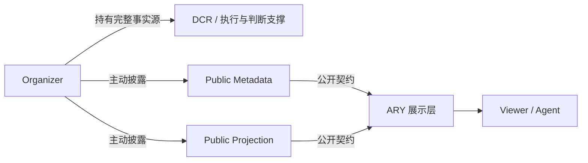

# ARY GRS 001 创世骑行记录 (Riding Record)

**核心理念：** 人不是把活完全丢给 Agent，而是在骑行、检查、纠偏。在 Agent 时代，工程师更像是一名“骑手”，驾驭着强大的 AI 引擎，在探索中不断修正航向。

## 逐问逐答的骑行记录（按问题与回答组织）

本文件不是泛泛而谈“AI Agent Riding 的意义”，而是按本次课程过程中真实提出的关键问题与对应回答，整理出的逐段骑行记录。每一段都对应一次具体的思考节点、一次设计纠偏，或一次架构判断。

---

### Q1. 这个项目的核心架构到底是什么？

**我的回答：**
这个项目的核心架构，可以分成三段来理解：

#### 第一段：整体架构是什么
这个项目本质上是一个“公开展示层 + 私有事实源”分离的系统。Organizer 持有完整的 Race Source Facts；ARY 只接收 Organizer 主动披露的 Public Metadata 与 Public Projection；DCR 则作为执行与判断支撑层，负责真实运行时的内部逻辑与证据链。其核心目标是：让 ARY 能组织、展示和代理赛事，但不成为中心化的私有事实数据库。

#### 第二段：职责边界如何划分
1. **Organizer：事实主权方**  
   负责真实赛事事实、规则、参与者、执行记录、评审依据与私有细节的持有与管理。

2. **DCR：执行与判断支撑方**  
   负责赛事执行过程中的内部判断、日志和审计依据，是 Organizer 私有事实链的真实支撑。

3. **ARY：公开展示与组织方**  
   只保存 Organizer 主动披露的公开对象，不持有完整 Race Source Facts。它负责公开页面、展示逻辑、代理流和对外访问。

4. **Public Projection：公开契约对象**  
   是 Organizer 主动生成的脱敏版本，用来向 ARY 提供可展示的公开内容。它是“公开内容”与“真实事实”之间的桥梁。

#### 第三段：它为什么这样设计
这套设计不是为了把 ARY 做得很强，而是为了把数据主权和展示职责拆开。这样做的好处有三点：
- **降低耦合**：ARY 不需要依赖 Organizer 的全部内部实现；
- **强化边界**：完整事实留在 Organizer / DCR，ARY 只拿到公开对象；
- **便于演进**：后续可以继续加签名、版本、审计、身份认证，而不影响核心边界。

**结构关系图：**

```text
Organizer / DCR
   │  持有真实事实源
   ├─> Public Metadata（基础公开信息）
   └─> Public Projection（脱敏后的公开投影）
             │
             ▼
          ARY 展示层
             ├─ 赛事创建 / 披露 / 组织
             ├─ 页面渲染 / 代理流 / 调试入口
             └─ Viewer / Agent 访问
```

**Mermaid 结构图：**



**这次骑行的意义：**
这一步把“概念边界”从文本要求变成了可执行的架构意识。后续所有实现都围绕这一点展开：谁持有事实、谁负责公开、谁负责展示，三者必须被清晰区分。

---

### Q2. 为什么你说这个项目的耦合度很低？

**我的回答：**
从软件工程理论上看，耦合是指一个模块对另一个模块内部实现细节或状态的依赖程度。低耦合的核心标准是：两个模块之间只依赖少量、稳定、可抽象的接口，而不是依赖彼此的全部实现细节、全量数据结构和内部状态。

在这个项目中，ARY 与 Organizer 之间的耦合之所以低，主要有三层理论依据：

1. **依赖对象是“公开契约”，而不是“完整事实”**  
   ARY 并不依赖 Organizer 的完整 Race Source Facts，而只依赖 Organizer 主动披露的 Public Metadata 与 Public Projection。也就是说，ARY 依赖的是一组经过定义、可验证、可展示的公开对象，而不是 Organizer 的私有内部模型。这符合低耦合的基本原则：依赖越少、越抽象、越稳定，耦合越低。

2. **模块之间的接口边界清晰，且职责互不越界**  
   Organizer 负责真实事实和私有执行链；ARY 负责公开展示和组织入口。它们之间不需要共享完整的数据结构，也不需要互相依赖复杂实现。这里的接口是“披露对象 + 版本约束 + 公开字段集”，而不是“直接访问私有数据库”。因此，二者之间的连接是薄的、明确的、可替换的。

3. **变化不会沿着全链路传播**  
   如果 Organizer 的内部执行逻辑调整，ARY 的页面与展示层不需要同步重构；如果 ARY 的前端展示方式改变，Organizer 的私有事实源也不需要改变。因为它们之间并没有“共享内部状态”或“深度耦合”的关系。换言之，变化被限制在公开契约层，而不会扩散到整个系统。

**从理论上可以这样证明它是低耦合：**
- 如果一个系统高度耦合，模块 A 的任何内部变化都可能迫使模块 B 做出修改；
- 但在这个项目中，ARY 的展示逻辑只依赖于公开投影的字段与版本，而不是依赖 Organizer 的真实执行链；
- 因此，Organizer 的内部变化不会必然引发 ARY 的重构，ARY 的展示变化也不会影响 Organizer 的私有事实来源。

这就是典型的“低耦合”表现：接口薄、职责清、依赖稳定、变化局部化。

**进一步从架构角度看：**
这个项目不是把完整事实链和展示层绑定在同一个模块中，而是把它们放在两个不同控制域里。这样做使得 ARY 只是一个“公开层”，Organizer 依然是“事实层”，两者通过少量公开对象耦合。这种设计正是软件架构中最常见的低耦合方式之一。

**这次骑行的意义：**
这一步让我把“低耦合”从一句口号变成了可解释的理论判断：不是因为页面简单，而是因为边界清晰、依赖薄、变化可局部化。它为后续的模块划分、接口设计和隐私保护奠定了基础。

---

### Q3. 这个项目的内聚性和扩展性如何？

**我的回答：**
从扩展性角度看，这个项目目前具备“可继续演进”的基础，但它仍然停留在 PoC 级别的扩展性，而不是成熟的生产级架构。原因在于：它已经形成了清晰的职责边界，但还没有把这些边界进一步抽象成完整的策略层、签名层、审计层和治理层。

如果从未来演进方向来看，它至少有四类可扩展空间：

1. **接口层的扩展**  
   当前的公开契约是 Public Metadata 和 Public Projection。未来可以继续扩展成更细粒度的公开对象，例如：
   - 赛事日程公开版；
   - 报名摘要公开版；
   - 结果快照公开版；
   - 赛事分组与赛道信息公开版。
   
   这类扩展不会破坏当前的边界，因为它们仍然属于“Organizer 主动披露的公开对象”。

2. **信任层的扩展**  
   现在的版本与哈希是概念雏形，未来可以升级为：
   - 数字签名；
   - 可验证披露日志；
   - 公开投影的审计链；
   - Organizer 身份认证与披露权限控制。
   
   这样一来，ARY 不只是“展示公开内容”，而是“展示可验证的公开内容”。这会显著增强可信度，也为真实生产环境做准备。

3. **展示层的扩展**  
   当前的展示页面只是一种最小可运行的公开页面。未来可以扩展成：
   - 多端展示（PC / 移动 / Agent 渲染）；
   - 赛事状态仪表盘；
   - 报名趋势与公开统计；
   - 多语言 / 多赛道 / 多版本的公开视图。
   
   因为 ARY 只是公开展示层，所以这些扩展都可以在不触碰私有事实源的前提下完成。

4. **治理层的扩展**  
   未来还可以进一步抽象出：
   - 披露策略引擎；
   - 公开字段白名单；
   - 敏感字段过滤规则；
   - 公开内容审批流。
   
   这意味着系统可以从“一个 PoC”演进成“一个真正可治理的公开披露平台”。

**从理论上看，这种扩展性之所以成立，是因为当前系统的核心是“职责边界清晰 + 契约稳定”**。只要公开字段、版本规则与展示入口保持稳定，后续的扩展就可以在不重写核心架构的前提下逐步增加。

也就是说，当前项目的扩展性不是来自“代码复杂”，而是来自“边界足够清晰”。这正是 PoC 级架构能够向真实系统演进的重要基础。

**这次骑行的意义：**
这一步让我把“扩展性”从一个模糊概念，变成了可以具体规划的演进路径：接口层、信任层、展示层、治理层都可以在现有基础上继续发展，而不会破坏整个设计的核心原则。

---

### Q4. 当前这个架构适合做什么，哪些地方会成为瓶颈？

**我的回答：**
这个架构最适合做的是：
- 概念验证；
- 方案演示；
- 接口契约验证；
- 数据主权与隐私边界的教学与评审。

但如果继续往真实系统推进，它最容易卡住的地方，理论上主要集中在四个方面：

1. **真正的持久化与状态管理**  
   目前 PoC 使用内存字典模拟数据存储，这在理论上很容易成为瓶颈，因为一旦进入真实运行环境，就必须面对：
   - 数据持久化；
   - 并发写入；
   - 版本回滚；
   - 公开对象与私有事实源之间的同步一致性。
   
   为什么会成为瓶颈？因为 PoC 里“看起来正常”是靠内存临时状态维持的，而真实系统中状态必须可追溯、可恢复、可审计。没有真正持久化，就很难支撑长期运营。
   
   如何解决？可以引入轻量持久层，如 SQLite / Postgres，以及版本化存储与事件日志机制，先把“公开对象”做成可持久化的状态机，再逐步把私有事实源与公开投影的同步规则固化。

2. **签名、身份与信任链**  
   当前的 mock hash / signature 只能说明“形式上有版本”，但不能证明“谁披露了它、是否被篡改、是否可信”。这在理论上是很典型的信任瓶颈。
   
   为什么会成为瓶颈？因为公开展示的可信性不是靠页面好不好看，而是靠“披露来源可验证、内容不可篡改、版本可追溯”。如果没有这三者，ARY 只是一个漂亮的展示层，而不是一个可信的公开平台。
   
   如何解决？可以逐步加入数字签名、身份认证、披露审计日志、版本哈希校验、可信时间戳等机制，形成一套从披露到展示的可验证链路。

3. **隐私检查的精度与语义级保护**  
   目前的检查是 key-level + value-level 的轻量方式，理论上足够阻止显式泄露，但不足以处理复杂语义泄露。例如，某些敏感信息可能不出现明显关键词，但通过组合上下文、结构关系、推断方式泄露。这样就会形成“防御层很薄”的瓶颈。
   
   为什么会成为瓶颈？因为隐私保护不是只依赖字段名，而是依赖对“源事实”是否被泄露的完整判断。PoC 里这种检查更像第一道门，不是最终防线。
   
   如何解决？可以将隐私检查升级成策略引擎：定义白名单、黑名单、敏感模式、语义规则与上下文规则，并把它纳入披露前置流程，而不是只在展示时做被动拦截。

4. **模块化工程化后的维护成本**  
   当前文件是单文件 PoC，逻辑集中在一个实现里。这在演示时很方便，但一旦项目扩大，就会出现维护成本飙升的问题：职责混杂、测试难、迭代慢、多人协作复杂。
   
   为什么会成为瓶颈？因为 PoC 的“好用”是靠集中实现获得的，而真实系统的“可维护”是靠模块边界和职责隔离获得的。二者并不等价。
   
   如何解决？可以把 Organizer、ARY、DCR、Public Projection 的逻辑拆成独立模块或服务，并引入标准接口、测试用例与配置层，使系统从“演示型”走向“工程型”。

**从理论上总结：**
这些瓶颈之所以容易出现，不是因为设计本身错了，而是因为当前项目还处于“概念验证阶段”。在这个阶段，架构的核心价值是“证明边界成立”，但一旦要进入真实运营，就必须补上持久化、信任、策略和工程化能力。

**这次骑行的意义：**
这一步让我从“能不能做出来”转向“适合在哪个阶段做、哪些问题必须在下一阶段解决”。这也是架构评审里最关键的判断：不是所有问题都要一口气解决，而是要明确哪些是当前阶段的瓶颈、哪些是未来的演进方向。

---

### Q5. 真实身份与信任链到底是什么？为什么它重要？

**我的回答：**
真实身份与信任链的核心，不是页面上写一个 Organizer 名字，而是要回答：
- 公开内容是谁披露的；
- 它是否被篡改；
- ARY 能否确认它确实来自合法 Organizer；
- 公开内容的版本、时间与来源是否可追溯。

如果把它展开成一个工程路线，可以分成以下几个方向，每个方向都对应不同的模块、技术原理与实施难度：

#### 方向一：身份认证（Identity Authentication）
- **需要实现的模块：** Organizer 身份注册模块、ARY 的认证校验模块、接入 Token / OAuth / mTLS 的网关层。
- **技术原理：**
  - Organizer 通过可信凭证证明自己是合法披露方；
  - ARY 对披露请求进行身份校验，防止伪造来源；
  - 可采用 JWT、API Key、OAuth 2.0、mTLS 等方式完成双向或单向认证。
- **难度预估：** 中等。  
  这是最基础的一层，难点在于如何在 PoC 级别就设计出“可扩展、可审计”的身份机制，而不是只用一个临时 token。

#### 方向二：数字签名（Digital Signature）
- **需要实现的模块：** 公钥/私钥生成模块、签名服务、签名校验模块、披露对象元数据包装器。
- **技术原理：**
  - Organizer 用私钥对 Public Metadata / Public Projection 生成签名；
  - ARY 用 Organizer 的公钥进行验签；
  - 如果签名不匹配，则说明内容被篡改或来源不可信。
- **难度预估：** 中高。  
  理论上实现并不复杂，但在真实系统中还要处理密钥轮换、证书管理、密钥存储和签名格式兼容性。

#### 方向三：哈希与版本校验（Hash + Version Verification）
- **需要实现的模块：** projection_hash 计算器、版本管理模块、冲突检测模块、幂等处理模块。
- **技术原理：**
  - 每次公开投影都生成 hash；
  - 版本号用于识别更新节奏；
  - ARY 通过 hash 与版本判断是否为旧版本、同版本同内容、同版本不同内容等不同情况。
- **难度预估：** 低到中等。  
  这是当前 PoC 已经具备的核心思路，进一步落地时主要是细化规则、增加审计字段和回滚策略。

#### 方向四：披露审计日志（Disclosure Audit Log）
- **需要实现的模块：** 审计日志写入器、事件回放模块、披露记录查询接口、溯源视图。
- **技术原理：**
  - 记录每一次披露的时间、版本、hash、发起方、目标对象、结果状态；
  - 后续可以做审计回放、责任追踪和复盘。
- **难度预估：** 中等。  
  审计日志本身并不难，但真正难的是“日志是否可信、是否不可篡改、是否能作为证据链的一部分”。

#### 方向五：可信时间与披露时间戳（Trusted Timestamp / Disclosure Time）
- **需要实现的模块：** 时间戳服务、披露时间记录器、时间校验模块。
- **技术原理：**
  - 除了“谁发的”与“内容对不对”，还需要知道“是什么时候披露的”；
  - 时间戳可以用于判断版本先后顺序、审计回溯和争议处理。
- **难度预估：** 中等。  
  这类能力的实现成本不高，但要与实际证书服务或时间源联动，才真正有可信价值。

#### 方向六：来源可追溯性（Provenance Traceability）
- **需要实现的模块：** source_id / disclosure_id / projection_id 追踪器、元数据溯源视图、关联图模块。
- **技术原理：**
  - 每个公开对象都有唯一来源标识；
  - ARY 可以追溯它从哪一份 Organizer 数据、哪一版投影、哪一次披露产生。
- **难度预估：** 中高。  
  这是从“能展示”走向“能证实来源”的关键一步，难点是建立完整的元数据链。

#### 方向七：可验证披露策略（Verifiable Disclosure Policy）
- **需要实现的模块：** 策略引擎、字段白名单、披露规则配置器、策略测试模块。
- **技术原理：**
  - 不只看“内容有没有被签名”，还要看“它是否符合当前允许披露的规则”；
  - 规则可以包括字段白名单、分类标签、版本要求、敏感字段过滤等。
- **难度预估：** 高。  
  这是从“简单筛查”走向“真正的治理机制”的方向，属于架构演进后期的重点。

**综合判断：**
如果把这些方向按成熟度排序，通常是：
1. 哈希与版本校验；
2. 审计日志；
3. 身份认证；
4. 数字签名；
5. 时间戳与来源追溯；
6. 可验证披露策略。

这说明，真实身份与信任链不是一项孤立功能，而是一个逐步升级的能力体系。PoC 目前只证明了“有公开对象和版本概念”，但真正的信任链还需要进一步补齐技术模块和治理规则。

**这次骑行的意义：**
这一步让我把“身份与信任链”从一个抽象概念，变成了一套可分解的工程方向。它不仅帮助我理解当前 PoC 的不足，也为后续从演示系统走向可信系统提供了清晰路径。

---

### Q6. 你说隐私检查逻辑比较轻量，具体是怎么回事？

**我的回答：**
当前的隐私检查主要是两层：
1. key-level 检查：防止明显敏感字段名进入 ARY；
2. value-level 检查：防止内容里出现明显的私有事实标记。

这已经能阻止很多显式泄露，比如 `private_rulebook`、`riding_records`、`submission_code`、`local://dcr/...` 这类内容混入公开投影。

但它仍然是“轻量”的，因为它更多依赖字段名和关键词，而不是语义级或组合级隐私审查。换句话说，它更像一层初级防线，而不是完整的隐私治理体系。

如果从未来优化方向来看，隐私检查可以继续演进成以下几个方向：

#### 优化方向一：从关键词规则升级到策略规则引擎
- **实现技术：**
  - 规则引擎（如基于 JSON/YAML 的策略配置）；
  - 字段白名单 / 黑名单机制；
  - 敏感类型标签系统（如 code、record、trace、evidence）。
- **意义：**
  - 不再只靠字符串关键词，而是把“什么字段能公开、什么字段不能公开”变成明确的规则。
  - 可以让隐私检查更可维护，也更适合后续扩展到多赛事、多场景。

#### 优化方向二：从 key/value 检查升级到语义级检测
- **实现技术：**
  - 正则模式匹配；
  - 语义标签器；
  - 上下文分析（例如判断某段内容是否在描述完整执行日志，而不是普通状态摘要）。
- **意义：**
  - 能更好识别“表面上看起来正常，但实质上泄露了私有事实”的内容。
  - 这类方法比简单关键词更接近真实生产环境中的隐私保护需求。

#### 优化方向三：增加组合泄露检测
- **实现技术：**
  - 关联规则分析；
  - 多字段联合判断；
  - 图结构分析（把字段、值、上下文关系看成图中的节点）。
- **意义：**
  - 一些敏感信息不是单个字段泄露，而是多个公开字段组合起来就能推导出私有事实。
  - 组合泄露是真实隐私风险中很常见的一类问题，因此这是未来非常重要的优化方向。

#### 优化方向四：引入披露前置检查，而不是只在展示时拦截
- **实现技术：**
  - 发布前校验 pipeline；
  - 提交时的 schema validation；
  - 公开对象净化器（sanitizer）。
- **意义：**
  - 可以在数据进入 ARY 之前就拦截风险内容，而不是等到页面渲染时才发现问题。
  - 这会显著减少“隐私问题被动暴露”的概率，也更符合工程上的最佳实践。

#### 优化方向五：做“风险分级”而不是简单的 yes/no 判定
- **实现技术：**
  - 风险评分模型；
  - 分级策略（低风险 / 中风险 / 高风险）；
  - 风险告警与人工复核流程。
- **意义：**
  - 不是所有内容都必须被一刀切拒绝，有些内容可以允许公开但需要加注警示；
  - 这样更符合真实系统中“安全与体验并存”的需求。

#### 优化方向六：引入可信审计与回溯能力
- **实现技术：**
  - 审计日志；
  - 版本回溯；
  - 披露事件链追踪。
- **意义：**
  - 让隐私检查不仅能“拦截”，还能够“证明为什么拦截、什么时候拦截、谁负责审批”。
  - 这对真实生产系统和合规审查非常关键。

**总体来看，隐私检查未来的优化路径可以概括为：**
从“关键词过滤”走向“规则治理”，再走向“语义理解”和“可审计的披露控制”。

**这次骑行的意义：**
这一步让我清楚地意识到：隐私保护不是一个固定的开关，而是一个随着系统成熟而不断升级的能力体系。当前的逻辑是第一道门，未来的方向是把它做成更像策略引擎、更像治理机制、更像可信审计链的一部分。

---

### Q7. 在这次开发中，Agent 的作用到底是什么？

**我的回答：**
Agent 的作用不是替人“完成全部思考”，而是快速具象化方案、生成接口与页面、给出结构化草稿，让我能够很快看到问题是否成立。真正的判断力仍然来自人类：我们需要判断边界是否合理、隐私定义是否准确、产品重点是否偏离。

**这次骑行的意义：**
这一步让我把“AI Agent Riding”从一种口号，真正变成了一种协同开发方式：Agent 提供生成能力，人类提供方向盘与纠偏能力。

---

## 关键纠偏节点

在本次开发过程中，最关键的一次纠偏发生在“报名信息是否视为核心隐私资产”的判断上。

最初的假设倾向于把报名信息、RiderID 与报名计数都视为高敏感内容。但在实际产品逻辑和公开展示的要求下，我判断这不符合 ARY GRS 001 的真实目标。真正应该保护的是：
- 代码；
- 完整骑行记录；
- 执行日志；
- DCR 判断链；
- 评审证据；
- 复盘材料；
- 私有规则细节。

而公开报名摘要、报名计数、公开别名，只要经过 Organizer 的主动披露，就可以作为 Public Projection 展示。

这一轮纠偏直接推动了：
- 对 `FORBIDDEN_ARY_KEYS` 的重新定义；
- 对 `debug/privacy-check` 的修正；
- 对公开页面说明文案的更新；
- 对隐私边界的重新确认。

这正是“骑手在高速开发中踩刹车、换方向盘”的典型表现。

---

## Final Verification Loop

最后一轮工作不是继续堆叠功能，而是把 PoC 拉回验收闭环。我的重点不是“页面是否好看”，而是验证以下几点是否真正成立：

1. 端口与运行路径是否一致；
2. 创建公开对象与披露公开投影的旅程是否能跑通；
3. ARY 的泄露检查是否能拒绝 key-level 与 value-level 的私有源事实；
4. Projection version 与 projection hash 的规则是否成立；
5. 报名代理与公开展示是否仍然保持边界清晰。

这轮工作体现了“从生成到验收”的闭环，而不是停留在“生成了一个看起来可用的产物”。

---

## 总结

这份骑行记录的核心不是泛泛地谈“AI Agent Riding 的美好”，而是围绕一系列具体问题展开：

- 这个项目的架构边界是什么；
- 耦合、内聚、扩展性如何；
- 当前架构适合做什么、哪里会卡住；
- 真实身份与信任链为何重要；
- 隐私检查逻辑为什么是轻量的；
- 人机协同究竟如何影响产品与架构的判断。

这些逐个问题的回答，构成了本次 Agent Riding 的真实过程记录。

---

### 我是如何理解这个项目的

我对这个项目的理解，核心不是把它看成一套“漂亮的页面 + 一些接口”，而是把它当成一次对“数据主权”和“公开披露边界”的验证。我的直觉是：如果一个系统要真正支持去中心化的赛事展示，就不能把所有事实都集中在 ARY 这里，否则就失去了 Organizer 的主权和信任基础。于是我更关注的是，ARY 能否只承载公开元数据与公开投影，而把代码、骑行记录、执行日志、评审证据这些真实源事实留在 Organizer / DCR 侧。

从更具体的架构角度看，我把这个项目理解为一套“Public Yard / Private Race Source”模型的最小可运行原型。Organizer 是真实事实的来源，负责维护完整的 Race Source Facts；ARY 只是一个公开展示和组织层，负责接收 Organizer 主动披露的对象，并把它们呈现给 Viewer 或 Agent。这个结构的关键并不是“ARY 不做任何事情”，而是 ARY 不拥有完整事实能力。它只会拿到已经被脱敏、被定义为可公开的内容。这样一来，ARY 既可以提供赛事入口、展示页、代理流和调试视角，又不会成为一套新的中心化数据库。

我还把它理解成一种很强的“边界驱动设计”。在这个架构中，最重要的不是页面多酷，而是每一层分别承担什么职责：
- Organizer 负责真实事实、私有执行、规则与结果来源；
- ARY 负责公开对象、投影版本、展示页面、代理跳转与说明层；
- DCR 则承担执行与判断的可信链角色，形成真实的事实来源与审计基础；
- Public Projection 是中间的公开契约，是 Organizer 主动披露给 ARY 的“可分发版本”。

因此，我对这个项目的理解并不是“把 ARY 做成一个大平台”，而是“把 ARY 做成一个可信的公开展示层”。从这个视角出发，项目的价值就在于：它用一个轻量 PoC 证明了一个基本命题——公开展示可以被组织起来，但真实事实来源必须保留在更安全、更有主权的控制域中。

如果往后进一步扩展，我会把这个架构设想成三层演进路径：
1. 现在的 PoC 层：用内存字典模拟 Organizer、ARY 与公开投影，验证边界是否成立；
2. 下一阶段的协议层：引入更正式的签名、版本、哈希、披露审计与身份认证机制，使“谁披露了什么、什么时候披露、版本是否一致”变成可验证的信息；
3. 进一步的产品层：把公开页面、报名代理、数据披露流程与对外展示能力组合成一个可持续的赛事入口系统。

我也认为这个项目的关键难点并不是“能不能写出页面”，而是“能不能把公开与私有的边界写清楚”。因为只要边界被明确，后续无论是增加更多赛事类型、增加更多投影字段，还是接入真实签名、真实身份链，架构都能继续演化，而不会马上失控。对我来说，这正是这个项目真正值得学习和讨论的地方。
---

## 最终验收闭环

最后一轮不是继续堆叠新功能，而是把 PoC 拉回验收闭环：

1. 检查端口与运行路径是否一致；
2. 确认创建公开对象与披露公开投影的旅程可以跑通；
3. 验证 ARY 的泄露检查能拒绝 key-level 与 value-level 的私有源事实；
4. 检查 Projection version 与 projection hash 的规则是否成立；
5. 确认报名代理与公开页面仍然保持“公开展示、私有事实源”的边界。

这轮工作体现了从“生成代码”到“验证边界与演示风险”的闭环，而不是停留在表面可用性。
