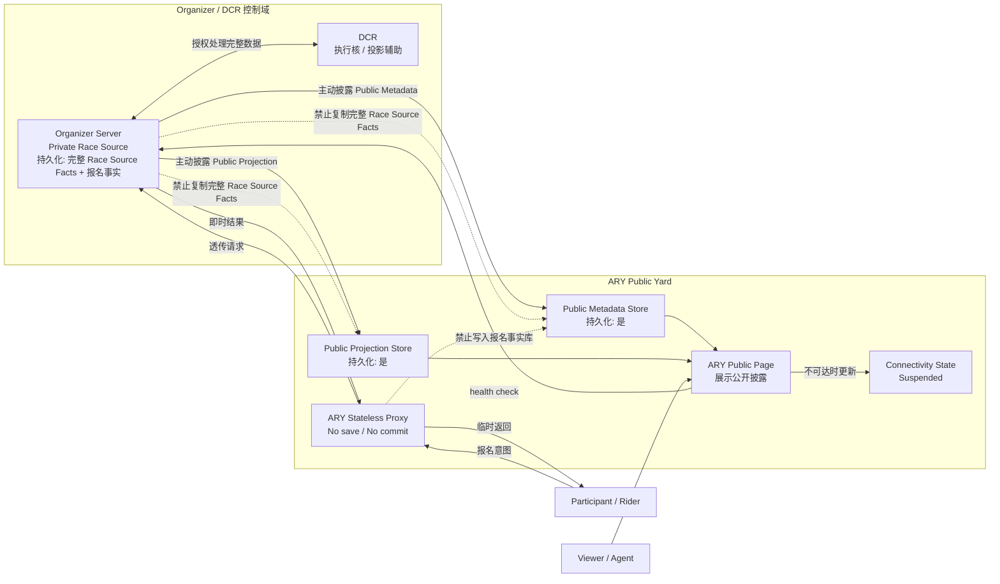

# ARY GRS 001 系统架构设计

## 1. 文档定位

本文对齐小组 PRD 的 “Public Yard, Private Race Source” 架构。目标不是重写系统，而是明确后续实际 PoC 代码必须遵守的组件、数据权限和持久化边界。

## 2. 架构原则

- Organizer Server / DCR 控制域持久化完整 Race Source Facts。
- ARY 可持久化 Public Metadata / Public Projection，但必须来自 Organizer 主动披露。
- ARY 不持久化完整 Race 数据，不沉淀自有报名事实库。
- ARY Stateless Proxy 只做请求形状校验、路由、超时控制和错误归一化。
- 长期报名摘要必须来自 Organizer 主动披露的 Public Projection。
- `Suspended` 是公开可达性状态，不是赛事内部事实。
- 日志、缓存、debug 输出、验证材料不得泄露核心私有源事实。

## 3. 组件职责

| 组件 | 职责 | 可访问数据 | 持久化位置 |
| --- | --- | --- | --- |
| Organizer Server | Private Race Source；接收报名、写入报名事实、管理完整 Race | 完整 Race Source Facts、报名事实、公开披露 payload | Organizer 控制域 |
| DCR | 执行核、规则处理、投影生成辅助 | Organizer 授权的完整 Race 数据 | Organizer / DCR 控制域 |
| ARY Server | Public Yard；保存公开对象、公开投影、公开状态并渲染页面 | Public Metadata、Public Projection、公开可达性状态 | ARY |
| ARY Stateless Proxy | 转发 Participant 报名意图到 Organizer Server | Registration Transit Payload 瞬时载荷 | 不持久化报名事实 |
| Public Metadata Store | 存储 Race Shell 和公开基础信息 | Organizer 主动披露的公开元数据 | ARY |
| Public Projection Store | 存储公开投影、版本、hash、签名 | Organizer 主动披露的公开投影 | ARY |
| Verification Evidence | 汇总边界检查、字段清单、失败用例 | 字段名、路径、结果，不含私有正文 | 验证材料 |

## 4. Mermaid 架构图

## 5. 数据持久化边界

| 数据类型 | 示例 | 所有者 | ARY 是否持久化 | 规则 |
| --- | --- | --- | --- | --- |
| Race Source Facts | 参赛者代码、完整骑行记录、执行日志、DCR 判断链、评审证据、复盘材料、私有规则 | Organizer / DCR | 否 | 只能留在 Organizer / DCR 控制域 |
| Public Metadata | 标题、简介、公开状态、公开时间窗口、标签、公开入口 | Organizer 主动披露 | 是 | 可存储、索引、展示 |
| Public Projection | 公开赛程摘要、公开报名计数、公开 alias、展示卡片、公告 | Organizer 主动披露 | 是 | 必须通过 schema 和 forbidden marker 检查 |
| Registration Transit Payload | `race_public_id`、`rider_id`、`client_request_id` | Participant / Organizer Server | 否 | 只可短暂经过 ARY Proxy |
| Public Registration Summary | 报名计数、公开 RiderID / nickname、公开参与状态 | Organizer 主动披露 | 是 | 必须作为 Public Projection 来源 |
| Connectivity State | `Suspended`、online/offline、checked_at | ARY 公开可达性检查 | 是 | 不代表内部赛事状态 |

## 6. 隐性复制检查

| 路径 | 风险 | 处理 |
| --- | --- | --- |
| Projection 过宽 | 公开投影接近完整 Race 数据 | forbidden key/value marker、字段溯源、发布前预览 |
| Proxy 日志 | 请求体或错误详情泄露私有源事实 | 日志白名单；默认不记录请求体 |
| Proxy 聚合 | ARY 从代理请求生成报名事实库 | 禁止 `save()` / `commit()`；验收检查无报名 store |
| Debug 输出 | 验证接口泄露私有正文 | 只输出字段路径、布尔结果和清单 |
| 缓存撤回 | 旧公开正文被当作有效内容 | Withdrawn / Suspended 只展示状态，不补正文 |
| DCR 输出 | 中间判断链外传到 ARY | 输出清单只允许公开投影和边界检查结果 |

## 7. 架构自检

| 自检项 | 状态 |
| --- | --- |
| 吸收 Public Metadata / Projection 可由 ARY 持久化 | 通过 |
| 引入 Participant / Rider、Registration Proxy、Organizer Server | 通过 |
| 明确报名事实只写 Organizer Server | 通过 |
| 明确 ARY Proxy 不 `save()` / `commit()` | 通过 |
| 明确 `Suspended` 状态含义 | 通过 |
| 保留 DCR 输出、字段溯源、缓存撤回和验证证据边界 | 通过 |
