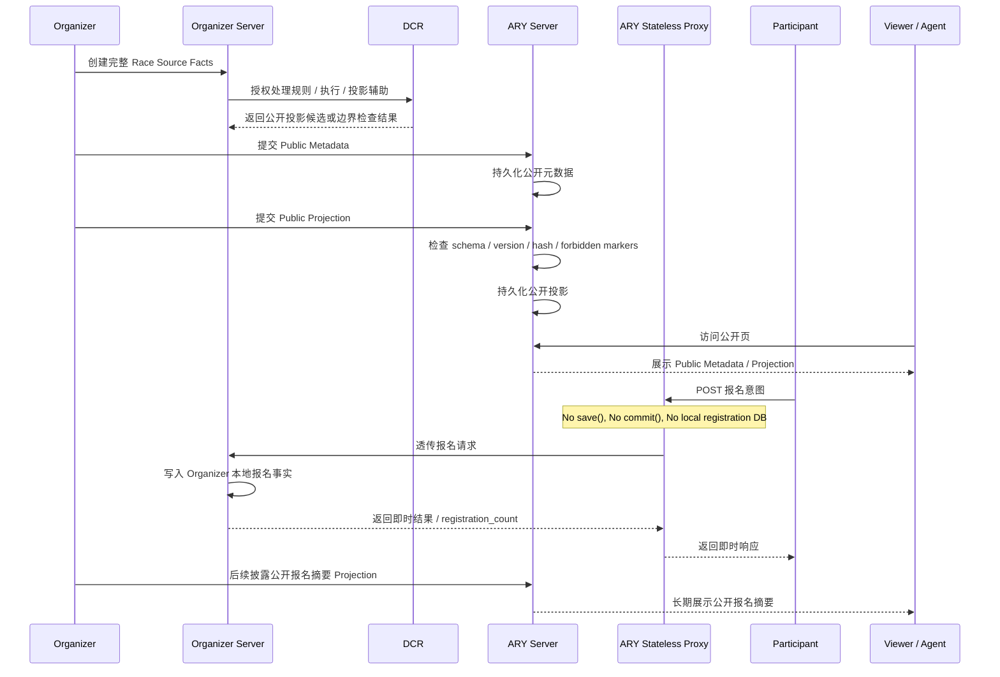
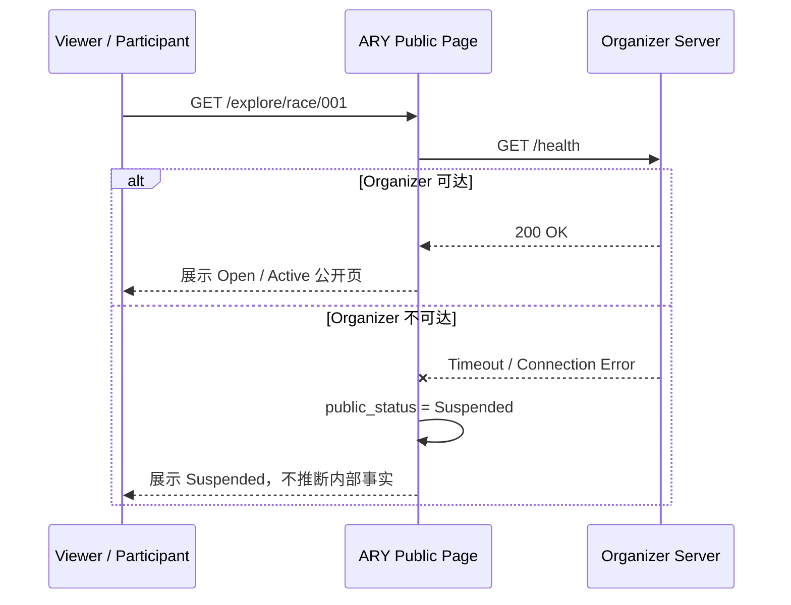

# ARY GRS 001 数据流说明

## 1. 文档定位

本文说明小组 PRD 基准下的数据方向、所有者、权限和持久化位置，并把个人原有的字段溯源、缓存撤回、DCR 输出边界迁移为可验证规则。

## 2. 数据流总览

```text
Race Source Facts：Organizer Server / DCR 内部持久化，不进入 ARY。
Public Metadata：Organizer -> ARY Metadata Store，ARY 可持久化。
Public Projection：Organizer -> ARY Projection Store，ARY 可持久化。
Registration Transit Payload：Participant -> ARY Stateless Proxy -> Organizer Server，ARY 不持久化。
Public Registration Summary：Organizer -> Public Projection -> ARY，ARY 可长期展示。
Connectivity State：ARY health check -> Suspended / online，ARY 可保存公开可达性状态。
```

## 3. Mermaid 时序图



## 4. Organizer 离线挂起流



## 5. 数据分类与持久化边界

| 数据 | Organizer Server / DCR | ARY Metadata Store | ARY Projection Store | ARY Proxy | ARY Display |
| --- | --- | --- | --- | --- | --- |
| `private_rulebook` | 是 | 禁止 | 禁止 | 禁止 | 禁止 |
| `submission_code` | 是 | 禁止 | 禁止 | 禁止记录 | 禁止 |
| `riding_records` | 是 | 禁止 | 禁止 | 禁止 | 禁止 |
| `execution_logs` | 是 | 禁止 | 禁止 | 禁止 | 禁止 |
| `dcr_judgement_trace` | 是 | 禁止 | 禁止 | 禁止 | 禁止 |
| `review_evidence` | 是 | 禁止 | 禁止 | 禁止 | 禁止 |
| `race_public_id` | 是 | 是 | 是 | 瞬时处理 | 是 |
| `rider_id` | 报名事实写入 | 禁止由代理沉淀 | 仅 Organizer 主动披露时可作为公开 alias | 瞬时处理 | 即时响应可临时展示 |
| `registration_count` | 是 | 不由代理聚合 | Organizer 主动披露后可持久化 | 即时透传 | 可展示投影来源的长期计数 |
| `public_status` | 可声明 | 是 | 是 | 可更新 Suspended | 是 |
| `projection_hash` / `signature` | 可生成 | 可记录版本 | 是 | 不涉及 | 可展示来源 |

## 6. 权限规则

| 操作 | 发起方 | 允许 | 禁止 |
| --- | --- | --- | --- |
| 创建完整 Race | Organizer / DCR | 写入 Organizer Server / DCR 控制域 | 写入 ARY |
| 创建公开对象 | Organizer | 向 ARY 提交 Public Metadata | 提交 Race Source Facts |
| 披露投影 | Organizer | 向 ARY 提交 Public Projection | 包含私有代码、完整骑行记录、执行日志、评审证据 |
| 报名代理 | Participant / ARY Proxy | 透传到 Organizer Server | ARY `save()` / `commit()` 报名事实 |
| 报名写入 | Organizer Server | 写入本地报名事实库 | 要求 ARY 代存 |
| 长期报名展示 | Organizer | 主动披露 Public Projection | ARY 从代理请求聚合 |
| Suspended | ARY | 保存公开可达性状态 | 推断赛事内部执行状态 |
| Debug 验证 | ARY | 输出字段路径、清单、布尔结果 | 输出私有正文 |

## 7. 缓存、日志与 debug 规则

- ARY 可缓存 Public Metadata / Public Projection 和 connectivity state，但不得缓存 Race Source Facts。
- Proxy 默认不记录请求体；如需日志，只记录 route、status、duration、client_request_id hash。
- Organizer 返回的私有错误详情不得透传到长期日志或 debug 输出。
- Withdrawn / Suspended / 过期时，不使用旧缓存补全公开正文。
- 验证证据页只展示字段名、路径、映射和结果，不展示私有内容正文。

## 8. 数据流自检

| 自检项 | 状态 |
| --- | --- |
| 标明 Public Metadata / Projection 可由 ARY 持久化 | 通过 |
| 标明 Registration Transit Payload 不由 ARY 持久化 | 通过 |
| 标明报名事实只写 Organizer Server | 通过 |
| 标明长期报名摘要必须来自 Organizer Projection | 通过 |
| 标明 Suspended 不代表内部事实 | 通过 |
| 标明日志、缓存、debug 不得泄露核心私有源事实 | 通过 |
